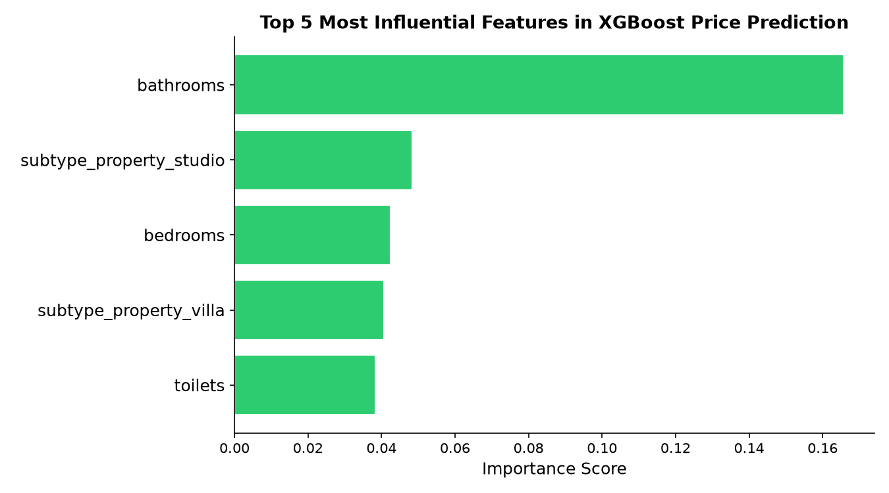
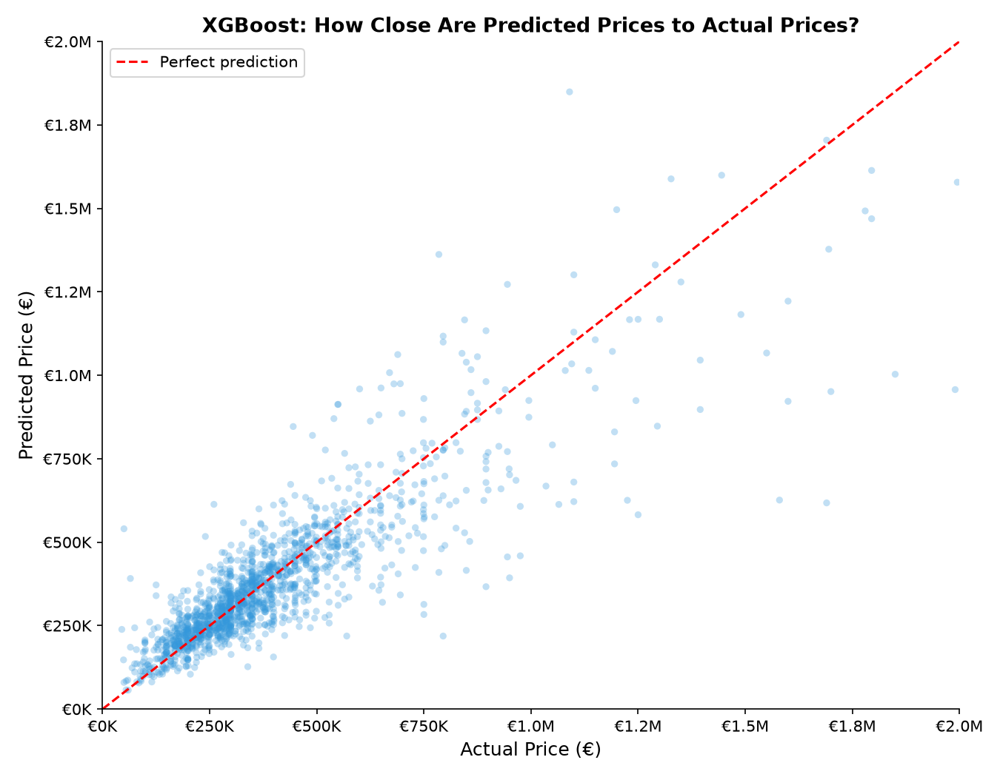

# 🏠 Immo Eliza — Real Estate Price Prediction


> A machine learning pipeline that predicts Belgian real estate prices using XGBoost, achieving a **Test R² of 0.7663** and a **Mean Absolute Error of €84,314** (~**25%** of median property price).

---

## 📋 Table of Contents
- [Project Overview](#-project-overview)
- [Dataset](#-dataset)
- [Project Structure](#-project-structure)
- [Pipeline](#-pipeline)
- [Results](#-results)
- [Visualisations](#-visualisations)
- [Installation](#-installation)
- [Usage](#-usage)
- [Future Improvements](#-future-improvements)

---

## 📌 Project Overview

This project is part of the **Immo Eliza** series at BeCode. After scraping, cleaning, and analysing Belgian real estate data, the goal here is to build a **reusable, production-ready ML pipeline** to predict property prices across Belgium.

Three models were explored:
| Model | Test R² | MAE | Overfitting |
|---|---|---|---|
| Linear Regression | 0.5979 | €110,248 | No ✓ |
| Random Forest | 0.5880 | €100,048 | No ✓ |
| **XGBoost** | **0.7663** | **€84,314** | Yes ⚠️* |

> *Overfitting flagged by Train R² (0.91) vs Test R² (0.77) gap. However, CV R² of **0.7505** confirms the model genuinely generalises well — the gap is expected behaviour for gradient boosting on tabular data.

**XGBoost** was selected as the final model due to its superior performance across all metrics.

---

## 📊 Dataset

- **Source**: Scraped from Immoweb.be (previous sprint)
- **Raw size**: ~10,073 rows × 53 columns
- **After cleaning**: **7,727 rows × 21 features**
- **Target variable**: `price` (log-transformed during training)
- **Rows removed**:
  - **138** duplicate rows dropped
  - **1,415** rows with `livable_surface < 15m²` dropped (data errors)

### Key Features Used
| Feature | Type | Correlation with Price |
|---|---|---|
| `bathrooms` | Numeric | 0.55 |
| `bedrooms` | Numeric | 0.45 |
| `swimming_pool` | Binary | 0.47 |
| `facades` | Numeric | 0.25 |
| `province` | Categorical (11) | — |
| `subtype_property` | Categorical (15) | — |
| `construction_year` | Numeric | 0.07 |

**Dropped features:**
- `property_id` — unique identifier, no predictive value
- `city` — **1,395** unique values, redundant with `latitude`/`longitude`
- `postal_code` — no linear geographic meaning
- 3 distance columns — correlation with price below **0.037**

---

## 📁 Project Structure

```
immo-eliza-ml/
├── assets/
│   ├── actual_vs_predicted.png
│   └── feature_importance.png
├── data/
│   ├── cleaned/
│   │   └── properties_for_ml.csv
│   └── raw/
│       ├── half_cleaned_properties.csv
│       └── scraped_properties.csv
├── dev_notebooks/
│   └── EDA.ipynb
├── models/
│   └── xgboost.joblib
├── src/
│   ├── evaluate.py
│   ├── predict.py
│   ├── preprocess.py
│   └── train.py
├── .gitignore
├── main.py
├── README.md
├── requirements.txt
└── test_prediction.json
```

---

## ⚙️ Pipeline

The pipeline is fully modular and reusable:

```
Raw CSV
   ↓
structural_clean_data()     ← drop columns, fix values, filter outliers
   ↓
train_test_split (80/20)
   ↓
sklearn Pipeline
   ├── ColumnTransformer
   │   ├── Numeric  → SimpleImputer(median) → StandardScaler
   │   └── Categorical → SimpleImputer(most_frequent) → OneHotEncoder
   └── XGBRegressor
   ↓
evaluate_model()            ← R², MAE, CV R², overfitting check
   ↓
predict_from_json()         ← predictions on new properties
```

**Key design decisions:**
- `structural_clean_data()` runs **before** the split — deterministic, no statistics learned, zero leakage risk
- `sklearn Pipeline` with `OneHotEncoder(handle_unknown="ignore")` handles rare/unseen categories at prediction time automatically
- `price` is **log-transformed** (`np.log1p`) before training to handle right skew, reversed with `np.expm1` at prediction
- **RandomizedSearchCV** (30 iterations, 5-fold CV) used to tune XGBoost hyperparameters

### Final XGBoost Hyperparameters
```python
n_estimators     = 700
learning_rate    = 0.05
max_depth        = 5
subsample        = 0.8
colsample_bytree = 0.7
min_child_weight = 5
```

---

## 📈 Results

### XGBoost — Final Metrics
| Metric | Value |
|---|---|
| Train R² | 0.9143 |
| **Test R²** | **0.7663** |
| CV R² (5-fold) | 0.7505 |
| **Test MAE** | **€84,314** |
| Median Property Price | ~€333,000 |
| **Avg Error** | **~25% of median price** |

---

## 📉 Visualisations

### Top 5 Most Influential Features in XGBoost Price Prediction


### XGBoost: How Close Are Predicted Prices to Actual Prices?


---

## 🛠️ Installation

```bash
# Clone the repository
git clone https://github.com/your-username/immo-eliza-ml.git
cd immo-eliza-ml

# Create virtual environment
python -m venv immo-eliza-ml-env
source immo-eliza-ml-env/bin/activate  # Windows: immo-eliza-ml-env\Scripts\activate

# Install dependencies
pip install -r requirements.txt

# Mac only — required for XGBoost
brew install libomp
```

---

## 🚀 Usage

### Train and evaluate the model
```bash
python main.py
```

### Predict on new properties
Edit `test_prediction.json` with your property details, then run:
```bash
python main.py
```
Predictions are printed at the end of the pipeline automatically.

### Example `test_prediction.json` entry
```json
{
    "_description": "My property",
    "province": "antwerp",
    "type_property": "house",
    "subtype_property": "villa",
    "livable_surface": 200.0,
    "bedrooms": 4.0,
    "bathrooms": 2,
    "facades": 4,
    "swimming_pool": 1,
    "garden": 1,
    "garage": 1,
    "terrace": 1,
    "toilets": 3,
    "latitude": 51.22,
    "longitude": 4.40,
    "construction_year": 2010,
    "state_of_property": "good",
    "heating_type": "gas",
    "sun_exposure": "south",
    "epc_score": "b",
    "flooding_area_type": "no_flooding_area"
}
```

---

## 🔮 Future Improvements

- **More features** — `showers`, `floor_area`, `proximity to amenities` showed potential in raw data but had **>75% missing values**
- **Richer dataset** — only **~7,700 rows** after cleaning; more data would likely push MAE below **€70,000**
- **Stacking ensemble** — combining XGBoost with Random Forest predictions as meta-features
- **Geographic clustering** — grouping properties by neighbourhood rather than province alone

---

## 👤 Author

**Uzair**
BeCode AI & Data Science Bootcamp
[GitHub](https://github.com/your-username) · [LinkedIn](https://linkedin.com/in/your-profile)